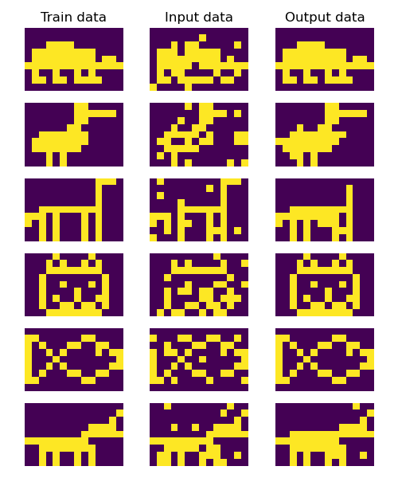

# Hopfield Neural Network from scratch
Implementation of Hopfield NN.

Below I show the results of Hopfield NN. The network that detects animals was trained on 6 different images. Then Hopfield NN was given partially blurred images as an input. Even though NN was able to recreate images almost perfectly because of its memory.

## Tests

